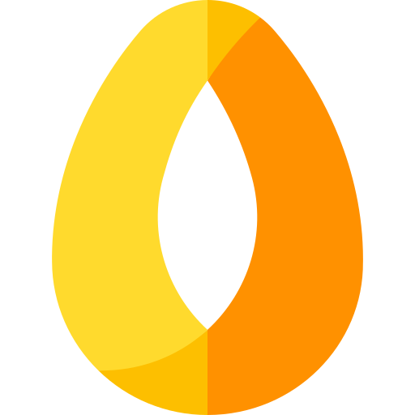

<p align="center">
  
</p>
<h1 align="center">DashMyBoard</h1>
<p align="center"><em><a href="README.md">English version</a></em></p>

Ein selbst gehostetes Dashboard hinter dem eigenen Single Sign-On. Es gibt einem Team einen
Ort, an dem es seine Dienste findet: einen gruppierten Linktree, eine Lesezeichenleiste und
Seiten, die andere Werkzeuge einbetten — alles **direkt auf der Seite** bearbeitbar, ohne
getrenntes Verwaltungspanel.

Gebaut mit FastAPI, Jinja2 und [TinySesam](https://github.com/Ollornog/TinySesam) für OIDC.
Kein Datenbankserver, kein Build-Schritt: die Inhalte stehen in einer einzigen `links.json`
in einem Volume.

---

## Was es kann

**Seiten sind Daten, kein Code.** Ein Administrator legt sie im Browser an. Drei Arten:

| Art | Was sie ist | Inhalt bearbeitbar |
|-----|-------------|--------------------|
| **Linktree** | Container, Gruppen und Einträge — die klassische Startseite | ja |
| **Reiter** | Die Lesezeichenleiste wird zur Reiterleiste, der Inhalt lädt in einem `iframe` | nur die Reiter |
| **Eingebaut** | Eine mitgelieferte Ansicht (`news`, `status`) | nein |

**Alles andere wird dort geändert, wo man es sieht.** Ein Bleistift schaltet den
Bearbeiten-Modus ein: in Titel tippen, Einträge zwischen Gruppen und Containern ziehen, bis zu
drei Ebenen tief verschachteln, Lesezeichen in Ordner legen. Strukturänderungen werden atomar
gespeichert und die Seite baut sich neu auf; reine Textänderungen kommen ohne Neuladen aus.

**Rollen kommen vom Identitätsanbieter.** Eine Gruppe namens `admin` (konfigurierbar) wird zur
Rolle, die bearbeiten darf. Container, Lesezeichen und ganze Seiten lassen sich auf eine Rolle
beschränken — eine Seite, die jemand nicht sehen darf, antwortet mit `404`, nicht mit `403`.

**Das Aussehen ist einstellbar, nicht einbetoniert.** Drei Designs (hell, ambient, dunkel),
eine Hintergrund-Diashow je Seite und je Design Farbe und Deckkraft für jede Fläche:
Titelleiste, Lesezeichenleiste, Container und die Maske über dem Hintergrundbild.

## Bildschirmfotos

Die Oberfläche ist auf Deutsch. Die Bildschirmfotos liegen in [`docs/`](docs/).

## Voraussetzungen

- Ein OIDC-Anbieter (beliebig: Keycloak, Authentik, Pocket ID, Authelia …)
- Ein Reverse-Proxy, der TLS terminiert
- Docker oder Python 3.10+

## Schnellstart

```bash
git clone https://github.com/Ollornog/DashMyBoard.git
cd DashMyBoard
cp .env.example .env      # BASE_URL, OIDC_ISSUER, OIDC_CLIENT_ID, OIDC_CLIENT_SECRET setzen
docker compose -f compose.example.yml up -d --build
```

Den Reverse-Proxy auf `127.0.0.1:8000` zeigen lassen und beim Anbieter diese Rücksprungadresse
eintragen:

```
https://dashboard.example.com/auth/oidc/callback
```

Dieser Pfad ist von TinySesam fest vergeben. Ein abweichender fällt erst **nach** der Anmeldung
auf — ein unangenehmer Ort, um einen Tippfehler zu entdecken.

Danach den Administrator in die OIDC-Gruppe aus `ADMIN_ROLE` (Vorgabe `admin`) aufnehmen,
anmelden — der Bleistift erscheint.

Vollständige Konfiguration: [`docs/configuration.de.md`](docs/configuration.de.md).
Seitenarten und die Grenzen der Einbettung: [`docs/pages.de.md`](docs/pages.de.md).

## Eine Warnung zur Einbettung

Die meisten selbst gehosteten Dienste **verweigern die Einbettung**. Sie senden
`X-Frame-Options: SAMEORIGIN` oder `Content-Security-Policy: frame-ancestors 'none'`, und ein
Reiter, der auf sie zeigt, bleibt weiß. Das ist eine Schutzfunktion, kein Fehler, und sie lässt
sich nicht seriös umgehen.

DashMyBoard fragt deshalb vorher beim Ziel nach: `GET /api/embeddable?url=…` liest die Kopfzeilen,
und der Dialog warnt. Jeder Reiter bietet zusätzlich **in neuem Tab öffnen** als ehrlichen
Ausweg. Wo ein Werkzeug **öffentliche Freigabelinks** kennt, sind sie der bessere Weg — eine
eingebettete Seite, die eine Anmeldung braucht, zeigt eine Anmeldung, weil Browser
Drittanbieter-Cookies zunehmend blockieren.

## Aktualisieren

Nichts aktualisiert sich selbst. Die Version bestimmt, wer installiert.

| Betriebsart | Pin | Update | Rollback |
|-------------|-----|--------|----------|
| Container | `image: ghcr.io/ollornog/dashmyboard:v0.3.0` | Tag hochziehen, `docker compose pull && up -d` | alten Tag zurück |
| Unveränderlich | `…@sha256:…` (Digest, steht im Log des Release-Laufs) | neuer Digest | alter Digest |

Über neue Versionen informiert der [Releases-Feed](https://github.com/Ollornog/DashMyBoard/releases).
Einen `latest`-Tag gibt es bewusst nicht: ein wandernder Tag macht jeden Neustart zum Glücksspiel.

## Entwicklung

```bash
pip install -e ".[dev]"
./scripts/check.sh          # Fach-, Browser- und Hygiene-Tests
./scripts/check.sh --fast   # ohne Browser-Test
git config core.hooksPath .githooks
```

Die Suite startet ihren eigenen Server auf einem frischen Datenverzeichnis und ist
**wiederholbar**: zweimal laufen lassen muss zweimal grün sein. Siehe
[`docs/development.de.md`](docs/development.de.md) und [`CONTRIBUTING.de.md`](CONTRIBUTING.de.md).

## Sicherheit

Schwachstellen bitte vertraulich melden — siehe [`SECURITY.de.md`](SECURITY.de.md).

## Lizenz

[MIT](LICENSE)

---

<sub>Logo: <a href="https://www.flaticon.com/free-icons/cultures" title="cultures icons">Cultures icons created by Iconjam - Flaticon</a></sub>
